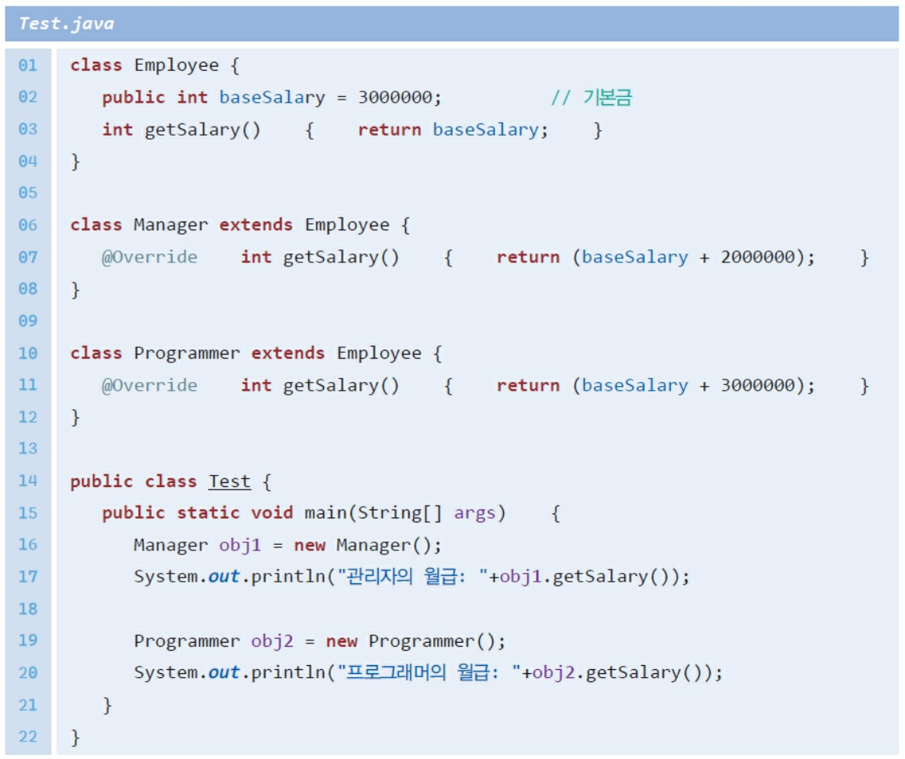

# 6장 상속

# Class 상속

## 상속이란?

- 상속의 개념은 현실 세계에도 존재한다.

### 상속의 형식

- 상속을 정의하려면 자식 클래스 이름 뒤에 extends를 쓰고 부모 클래스 이름을 적으면 된다.
- **“extends”**는 확장(또는 파생)한다는 의미이다. 즉 부모 클래스를 확장하여서 자식 클래스를 작성한다는 의미가 된다.

### 상속의 예

```java
class B{
    int speed;
    public void setSpeed(int speed){
        this.seed = speed;
    }
}
class A extends B{
    int A;

    public void charge(int amount) {
        A+=amount;
    }
}

public class C{
    public static void main(String[] args) {
        A a = new A();
        a.speed= 10;
        a.setSpeed(60);
        a.charge(10);
    }
}
```

- 무엇이 상속되는가?

- 상속받은 필드와 메소드 사용하기

- 왜 상속을 사용하는가?
    - 만약 우리가 원하는 코드를 가진 클래스가 이미 존재한다면 이 클래스를 상속받아서 이미 존재하는 클래스의 필드와 메소드를 재사용할 수 있다.
    - 상속을 사용하면 중복되는 코드를 줄일 수 있다.

### 자바 상속의 특징

- 다중 상속을 지원하지 않는다. 다중 상속이란 여러 개의 클래스로부터 상속 받는 것이다. 자바에서는 금지되어 있다.
- 상속의 횟수에는 제한이 없다.
- 상속 계층 구조의 최상위에는 java.lang.Object 클래스가 있다.
    - 예제: Animal 클래스와 Dog 클래스 만들어보기
    - 예제: 도형 예제
        - 일반적인 도형을 나타내는 Shape 클래스를 작성하고 이것을 상속받아서 원을 나타내는 Circle 클래스를 작성해보자.
        - AnimalTest.Java

## 상속과 접근 지정자

- 자식 클래스는 부모 클래스의 public 멤버, protected 멤버, 디폴트 멤버(부모 클래스와 자식 클래스가 같은 패키지에 있다면)를 상속받는다. 하지만 부모 클래스의 private 멤버는 상속되지 않는다.
- 예제 코드
    - 예제: Person 클래스와 Student 클래스 만들어보기
        - Person 클래스는 일반적인 사람을 나타낸다.
        - Person 클래스를 상속받아서 Student 클래스를 작성해보자.
        - Person 클래스 중에서 민감한 개인 정보는 private으로 지정한다. 예를 들어서 주민등록번호나 체중 같은 정보는 공개되면 안 된다.
        - 민감하지 않은 정보는 protected로 지정한다. 공개해도 좋은 정보는 public으로 지정한다.
```java
class Person{
    //일반적인 사람
    private String 주민번호;
    private int 체중;
    public String 이름;
    public int 나이;
    public int get체중(){
        return 체중;
    }
    public int set체중(int weight){
        this.체중= weight;
    }
}
class Student extends Person{
    int id;
    
}
class STest{
    public static void main(String[] args) {
        Student s = new Student();
        s.나이 = 21;
        s.이름 = "채현영";
        s.set체중(75);
    }
}
```


## 상속과 생성자

- 자식 클래스의 객체가 생성될 때, 자식 클래스의 생성자만 호출될까? 아니면 부모 클래스의 생성자도 호출되는가? 또 어떤 순서로 호출될까?
- 왜 Derived 객체를 생성했는데 Base 생성자까지 호출되는 것일까?
    - 자식 클래스 객체 안에는 부모 클래스에서 상속된 부분이 들어 있다.
    - 따라서 자식 클래스 안의 부모 클래스 부분을 초기화하기 위하여 부모 클래스의 생성자도 호출되는 것이다.
- 생성자의 호출 순서
    - (부모 클래스의 생성자) → (자식 클래스의 생성자) 순서이다.
    - 명시적인 생성자 호출
    - 묵시적인 생성자 호출
    - 오류가 발생하는 경우
        - 묵시적인 부모 클래스 생성자 호출을 사용하려면 부모 클래스에 기본 생성자(매개 변수가 없는 생성자)가 반드시 정의되어 있어야 한다.
- 부모 클래스의 생성자 선택
    - 예제: Person 클래스와 Employee 클래스 만들어보기
        - Person 클래스는 일반적인 사람을 나타낸다. Person 클래스를 상속받아서
          직원을 나타내는 Employee 클래스를 작성해보자.

## 메소드 오버라이딩

- 메소드 오버라이딩(method overriding)은 자식 클래스가 부모 클래스의 메소드를 자신의 필요에 맞추어서 재정의하는 것이다.
- 이때 메소드의 이름이나 매개 변수, 반환형은 동일하여야 한다.
- 예제
    - Rectangle 클래스의 객체에 대하여 draw()가 호출되면 Rectangle 클래스 안에서 오버라이딩된 draw()가 호출된다.
    - Shape의 draw()가 호출되는 것이 아니다.

<aside>
💡 경고
 철자를 잘못 쓰는 경우, 컴파일러는 이것을 새로운 메소드 이름으로 인식한다. -> 메소드 오버라이딩이 일어나지 않는다.
</aside>

- 키워드 **super를** 사용하여 부모 클래스 멤버 접근
    - 키워드 super는 상속 관계에서 부모 클래스의 메소드나 필드를 명시적으로 참조하기 위하여 사용된다.
    - 만약 부모 클래스의 메소드를 오버라이딩한 경우에 super를 사용하면 부모 클래스의 메소드를 호출할 수 있다.
- 예제

### 오버라이딩 vs 오버로딩

- 오버로딩(overloading)이란 같은 메소드명을 가진 여러 개의 메소드를 작성하는 것이다.
- 오버라이딩(overriding)은 부모 클래스의 메소드를 자식 클래스가 다시 정의 하는 것을 의미한다.

### 다형성

- 이들은 모두 다형성과 관련이 있다. 이름을 재사용하는 것은 같다. 오버로딩은 컴파일 시간에서의 다형성을 지원한다.
- 메소드 오버라이딩을 사용하면 실행 시간에서의 다형성을 지원할 수 있다.
- 정적 메소드를 오버라이드하면 어떻게 될까?
    - 자식 클래스가 부모 클래스의 정적 메소드와 동일한 정적 메소드를 정의하는 경우, 어떤 참조 변수를 통하여 호출되는지에 따라 달라진다.
    - Lab: Employee 클래스
        - 아래와 같은 상속 계층도를 가정하자. 일반 직원은 Employee 클래스로 모델링한다.
        - Employee 클래스를 상속받아서 관리자를 나타내는 Manager 클래스와 프로그래머를 나타내는 Programmer 클래스를 작성한다.
        


### 다형성이란?

- 다형성(polymorphism)이란 객체들의 타입이 다르면 똑같은 메시지가 전달되더라도 서로 다른 동작을 하는 것
- 다형성을 어떻게 사용할 수 있을까?
    - 사각형, 삼각형, 원과 같은 다양한 타입의 도형 객체들이 모여 있다고 하자.
    - 이 도형들을 그리고 싶으면 각 객체에 draw 메시지를 보내면 된다. 각 도형들은 자신의 모습을 화면에 그릴 것이다. 즉 도형의 타입을 고려할 필요가 없는 것이다

### 업캐스팅

- 하나의 예로 Rectangle, Triangle, Circle 등의 도형 클래스가 부모 클래스인 Shape 클래스로부터 상속되었다고 가정하자.
- 부모 클래스 변수로 자식 클래스 객체를 참조할 수 있다. 이것을 업캐스팅(upcasting, 상형 형변환)이라고 한다.
- 자식 클래스와 부모 클래스의 포함 관계
- 업캐스팅 vs 다운캐스팅
- 동적 바인딩
    - “부모 참조 변수를 가지고 자식 객체를 참조하는 것이 도대체 어디에 필요한가요?” ->여러 가지 타입의 객체를 하나의 자료 구조 안에 모아서 처리하려는 경우에 필요하다.
    - 모든 도형 클래스는 화면에 자신을 그리기 위한 메소드를 포함하고 있다고 가정한다. 이 메소드의 이름을 draw()라고 하자.
    - 각 도형을 그리는 방법은 당연히 도형에 따라 다르다. 따라서 도형의 종류에 따라 서로 다른 draw()를 호출해야 한다.
    - Shape가 draw() 메소드를 가지고 있고 Rectangle, Triangle, Circle 클래스들이 이 draw() 메소드를 오버라이딩하였다고 하자.
- 업캐스팅의 활용
    - 메소드의 매개 변수를 부모 타입으로 선언하면 훨씬 넓은 범위의 객체를 받을 수 있다.
    - 예를 들어서 메소드의 매개 변수를 Rectangle 타입으로 선언하는 것보다 Shape 타입으로 선언하면 훨씬 넓은 범위의 객체를 받을 수 있다.
    - instanceof 연산자
        - 변수가 가리키는 객체의 실제 타입을 알고 싶으면 instanceof 연산자를 사용하면 된다.
- 종단 클래스과 종단 메소드
    - 종단 클래스(final class)는 상속을 시킬 수 없는 클래스를 말한다.
    - 종단 클래스가 필요한 이유는 주로 보안상의 이유 때문이다.

- Lab: 도형 면적 계산하기
    - 상속 계층 구조에서 Shape 클래스의 getArea()를 오버라이드하여서 각 도형에 맞는 면적을 계산해보자
- Lab: 동물 다형성
    - 강아지와 고양이를 나타내는 클래스를 작성하자. 이들 클래스의 부모 클래스로 Animal 클래스를 정의한다.
    - 강아지와 고양이 클래스의 speak() 메소드를 호출하면 각 동물들의 소리가 출력되도록 프로그램을 작성해보자.

## 상속 vs 구성

- 구성은 클래스가 다른 클래스의 인스턴스를 클래스의 필드로 가지는 디자인 기법이다. 반면에 상속은 한 객체가 클래스를 상속받아서 부모 객체의 속성과 동작을 획득할 수 있는 기법이다.
- 구성 및 상속은 모두 클래스를 연결하여 코드 재사용성을 제공한다.
- 상속과 구성은 객체 지향 개발자가 사용하는 두 가지의 중요한 프로그래밍 기술이다.
- 상속은 한 클래스를 다른 클래스에서 파생시키는 반면 구성은 하나의 클래스를 다른 클래스의 집합으로 정의한다.
- is-a 관계
    - is-a 관계는 “A는 B의 일종이다.”라고 말하는 것과 같다.
    - 예를 들어 사과는 과일의 일종이고, 자동차는 차량의 일종이다. is-a 관계가 있으면 상속을 사용한다. 상속은 단방향이다.
    - 자동차는 탈것이다(Car is a Vehicle).
    - 사자, 개, 고양이는 동물이다.
    - 집은 건축물의 일종이다.
    - 벤츠는 자동차의 일종이다.
- has-a 관계
    - 만약 “~은 ~을 가지고 있다”와 같은 has-a(포함) 관계가 성립되면 이 관계는 상속으로 모델링을하면 안 된다. 이 경우에는 구성을 사용하여야 한다.
    - 자동차는 엔진을 가지고 있다.
    - 도서관은 책을 가지고 있다(Library has a book).
    - 집은 욕실을 가지고 있다.
    - 객체 지향 프로그래밍에서 has-a 관계는 구성 관계(composition) 또는 집합 관계(aggregation)를 나타낸다.
    - 상단 그림에서 자동차는 엔진을 가지고 있다. 검정색 다이아몬드 표시는 구성(composition)을 나타낸다. 자동차가 엔진으로 구성되었다고 생각하여도 된다.
    - 하단 그림에서 연못은 오리를 가지고 있다. 이때는 다이아몬드가 흰색인데 이것은 집합(aggregation)을 의미한다. 집합은 다이아몬드가 있는 객체가 다른 객체를 소유하고 있다는 것을 의미한다
- 구성 vs 집합
    - 구성: House에는 하나 이상의 Room이 있다. 이것은 구성이다.
    - Room은 House 없이는 존재하지 않으므로 Room의 수명은 House에 의해 제어된다.
    - 집합: Block을 모아서 ToyHouse를 만들 수 있다. 이것은 집합이다. ToyHouse가 분해되더라도 Block들은 남는다.
    - 잘못 사용하는 경우
        - Test 클래스와 ArrayList 클래스 간에는 전혀 관련이 없으므로 “is-a” 관계가 아니다.
    - 올바른 사용
- 예제: 구성과 상속
    - 간단한 예제를 살펴보자. 날짜를 나타내는 Date 클래스가 있다. 그리고 직원을 나타내는 Employee 클래스가 있다. Employee 클래스는 직원의 생일을 나타내는 필드인 birthDate를 가지고 있는데 이것은 Date 클래스의 참조 변수이다. 따라서 Employee 클래스는 Date 클래스를 가지고 있다고 할 수 있다. 전체를 UML 클래스 다이어그램으로 그리면 왼쪽과 같다.
