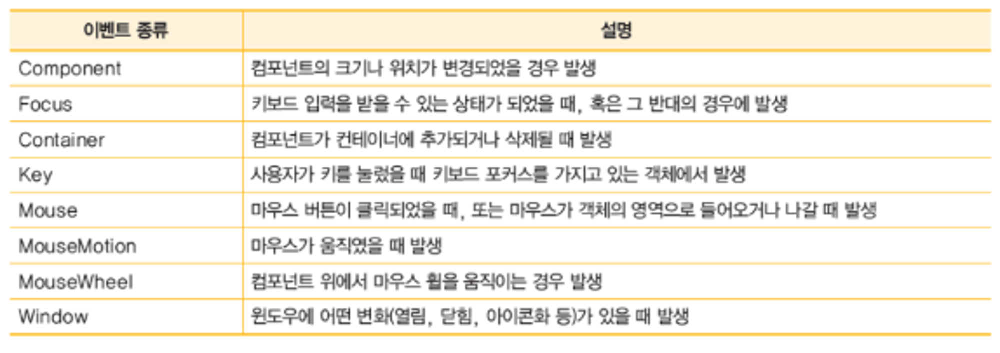
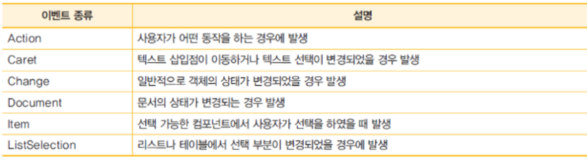
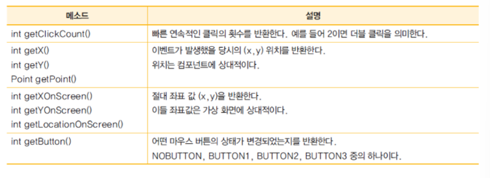

# 10장 이벤트 처리

# 이벤트 구동 프로그래밍


- 이벤트 구동 프로그래밍은 이벤트에 의하여 실행 순서가 결정되는 방식

## 이벤트와 이벤트 리스너

- 이벤트는 사용자가 버튼을 클릭한다거나 마우스를 움직이거나 키를 누르면 발생
- 발생된 이벤트 객체에 반응하여서 이벤트를 처리하는 객체를 이벤트 리스너라고 한다.

## 이벤트 처리과정

1. 이벤트 리스너를 작성한다.
  - 어떤 클래스가 이벤트 리스너가 되기 위해서는 리스너 인터페이스를 구현해야 한다.

    ```java
    class MyListener implements ActionListener{
    	public void actionPerformed(ActionEvent e){
    		//액션 이벤트가 발생하면 호출된다.
    		//액션 이벤트를 처리하는 코드가 여기 들어간다.
    	}
    }
    ```

2. 이벤트 리스너를 컴포넌트에 등록한다
  - 이벤트 리스너를 컴포넌트에 등록하는 단계

    ```java
    class MyListener implements ActionListener{ //프레임을 상속하여서 MyFrame 선언
    	public MyFrame(){  //생성자에서 컴포넌트를 생성하고 추가한다.
    		button = new JButton("동작"); //버튼 생성
    		button.addActionListener(new MyListener());
    
    	}
    }
    ```


## 이벤트 객체

- 이벤트 객체는 발생된 이벤트에 대한 모든 정보를 리스너로 전달한다.
- 이벤트 객체는 getSource() 액션 이벤트가 발생하면 호출된다. getSource()는 Object 타입으로 반환하므로 이것을 필요한 타입으로 형변환해서 사용하면 된다.

```java
public void actionPerformed(ActionEvent e){
	button = (JButton)e.getSource();
	...
}
```

# 이벤트 처리 방법

- ex : 카운터 프로그램
- 아래 프로그램에서 증가 버튼을 누르면 카운터 값이 하나씩 증가되어서 표시
- 액션 이벤트 처리 필요

## 내부 클래스가 이벤트를 처리하는 방법

```java
package Week04_chy;

import javax.swing.*;
import java.awt.FlowLayout;
**import java.awt.event.*; //패키지에 이벤트를 처리하는 클래스들이 모여 있음**

public class test extends JFrame {
  private JButton button;
  private JLabel label;
  int counter = 0;

  class MyListener implements ActionListener {
    @Override
    public void actionPerformed(ActionEvent e) {
      counter++;
            **label.setText("현재의 카운터 값 : " + counter);// 내부 클래스로 이벤트를 처리하는 클래스 정의**
    }

    public MyListener() {
      setSize(400, 150);
      setTitle("이벤트 예제");
      setLayout(new FlowLayout());
      button = new JButton("증가");
      label = new JLabel("현재의 카운터 값 " + counter);

            **button.addActionListener(new MyListener()); //버튼에 이벤트 처리 객체 등록**
      add(label, "Center");
      add(button, "East");

      setVisible(true);
      setDefaultCloseOperation(EXIT_ON_CLOSE);

    }

    public static void main(String[] args) {
      MyListener t = new MyListener();
    }
  }

}
```

## 외부 클래스가 이벤트를 처리하는 방법

```java
package Week04_chy;

import javax.swing.*;
import java.awt.FlowLayout;
import java.awt.event.*;

public class test extends JFrame {
  private JButton button;
  private JLabel label;
  int counter = 0;

  public test() {
    setSize(400, 150);
    setTitle("이벤트 예제");
    setLayout(new FlowLayout());
    button = new JButton("증가");
    label = new JLabel("현재의 카운터 값 " + counter);

    button.addActionListener(new MyListener());
    add(label, "Center");
    add(button, "East");

    setVisible(true);
    setDefaultCloseOperation(EXIT_ON_CLOSE);

  }

  public static void main(String[] args) {
    test t = new test();
  }

}

class MyListener implements ActionListener {
  @Override
  public void actionPerformed(ActionEvent e) {
    JButton button = (JButton) e.getSource();
        **//counter++;
    //label.setText("현재의 카운터 값 : "+counter);
    //counter와 label은 MyFrame 클래스 안에 있어서 접근하기 어렵다. 완전히 못하는 것은 아니다.**
  }
}
```

## 프레임 클래스가 이벤트를 처리하는 방법

```java
package Week04_chy;

import javax.swing.*;
import java.awt.FlowLayout;
import java.awt.event.*;

**

public class test extends JFrame implements ActionListener {
  //MyFrame 클래스는 JFrame 클래스를 상속받고 동시에 ActionListener를 구현한다. 따라서 프레임이 버튼에서 발생하는 이벤트도 처리할 수 있다.**
  private JButton button;
  private JLabel label;
  int counter = 0;

  @Override
  public void actionPerformed(ActionEvent e) {
    counter++;
    label.setText("현재의 카운터 값 : " + counter);
  }

  public void test() {
    setSize(400, 150);
    setTitle("이벤트 예제");
    setLayout(new FlowLayout());
    button = new JButton("증가");
    label = new JLabel("현재의 카운터 값 " + counter);

            button.addActionListener(this);
//현재 객체를 이벤트 리스너로 버튼에 등록한다. 즉 자기 자신이 이벤트를 처리한다고 등록한다.**
    add(label, "Center");
    add(button, "East");

    setVisible(true);
    setDefaultCloseOperation(EXIT_ON_CLOSE);

  }

  public static void main(String[] args) {
    test t = new test();
  }

}
```

## 익명 클래스를 사용하는 방법

- 익명 클래스 : 이름이 없는 클래스

```java
package Week04_chy;

import javax.swing.*;
import java.awt.FlowLayout;
import java.awt.event.*;

public class test extends JFrame {
  private JButton button;
  private JLabel label;
  int counter = 0;

  public test() {
    setSize(400, 150);
    setTitle("이벤트 예제");
    setLayout(new FlowLayout());
    button = new JButton("증가");
    label = new JLabel("현재의 카운터 값 " + counter);

            **button.addActionListener(new ActionListener() {
      @Override
      public void actionPerformed(ActionEvent e) {
        counter++;
        label.setText("현재의 카운터 값 : " + counter);
      }
    }); //익명 클래스는 ActionListener 인터페이스를 구현한다. 익명 클래스는 객체도 동시에 생성된다.**
    add(label, "Center");
    add(button, "East");

    setVisible(true);
    setDefaultCloseOperation(EXIT_ON_CLOSE);

  }

  public static void main(String[] args) {
    test t = new test();
  }

}
```

## 람다식을 이용하는 방법

- 이름이 없는 메소드(함수)라고 할 수 있다.
- 간결하다.

```java
package Week04_chy;

import javax.swing.*;
import java.awt.FlowLayout;

public class test extends JFrame {
  private JButton button;
  private JLabel label;
  int counter = 0;

  public test() {
    setSize(400, 150);
    setTitle("이벤트 예제");
    setLayout(new FlowLayout());
    button = new JButton("증가");
    label = new JLabel("현재의 카운터 값 " + counter);

            button.addActionListener(e -> {
              counter++;
              label.setText("현재의 카운터 값 : " + counter);
            }
    );
//람다식을 이용하여 이벤트를 처리하고 있다. 변수 e는 이벤트를 나타낸다. 람다식은 함수를 객체로 만들어서 메소드에 전달할 수 있다.**
    add(label, "Center");
    add(button, "East");

    setVisible(true);
    setDefaultCloseOperation(EXIT_ON_CLOSE);

  }

  public static void main(String[] args) {
    test t = new test();
  }

}
```

# 이벤트

## 저수준 이벤트

- 모든 컴포넌트에서 발생된다.
- 마우스나 키보드로부터 발생되는 이벤트

아래는 저수준 이벤트(로우 레벨 이벤트) 중 몇 가지 예시를 제공합니다. 이러한 이벤트들은 모든 컴포넌트에서 발생할 수 있으며, 주로 마우스와 키보드와 관련이 있습니다.

**1. 마우스 이벤트:**

- 마우스 클릭 (MouseListener를 사용)
- 마우스 이동 (MouseMotionListener를 사용)
- 마우스 드래그 (MouseMotionListener를 사용)
- 마우스 드롭 (DropTargetListener를 사용)

예제 (마우스 클릭):

```java
import javax.swing.*;
import java.awt.event.MouseAdapter;
import java.awt.event.MouseEvent;

public class MouseClickExample {
    public static void main(String[] args) {
        JFrame frame = new JFrame("Mouse Click Example");
        frame.setDefaultCloseOperation(JFrame.EXIT_ON_CLOSE);
        frame.setSize(300, 150);

        JPanel panel = new JPanel();

        panel.addMouseListener(new MouseAdapter() {
            public void mouseClicked(MouseEvent e) {
                System.out.println("Mouse Clicked at (" + e.getX() + ", " + e.getY() + ")");
            }
        });

        frame.add(panel);
        frame.setVisible(true);
    }
}
```

**2. 키보드 이벤트:**

- 키 누름 (KeyListener를 사용)
- 키 뗌 (KeyListener를 사용)
- 키를 누르고 있는 동안의 이벤트 (KeyListener를 사용)
- 포커스 관련 이벤트 (FocusListener를 사용)

예제 (키 누름):

```java
import javax.swing.*;
import java.awt.event.KeyEvent;
import java.awt.event.KeyListener;

public class KeyPressExample {
    public static void main(String[] args) {
        JFrame frame = new JFrame("Key Press Example");
        frame.setDefaultCloseOperation(JFrame.EXIT_ON_CLOSE);
        frame.setSize(300, 150);

        JPanel panel = new JPanel();

        panel.setFocusable(true);
        panel.addKeyListener(new KeyListener() {
            public void keyTyped(KeyEvent e) {
                // 이 메서드는 문자 키 누름 이벤트를 처리합니다.
                System.out.println("Key Typed: " + e.getKeyChar());
            }

            public void keyPressed(KeyEvent e) {
                // 이 메서드는 특수 키 누름 이벤트를 처리합니다.
                System.out.println("Key Pressed: " + e.getKeyCode());
            }

            public void keyReleased(KeyEvent e) {
                // 이 메서드는 키를 뗀 이벤트를 처리합니다.
                System.out.println("Key Released: " + e.getKeyCode());
            }
        });

        frame.add(panel);
        frame.setVisible(true);
    }
}
```

이러한 예제는 저수준 이벤트를 처리하는 방법을 보여줍니다. 이벤트 핸들러를 사용하여 마우스 및 키보드 이벤트를 감지하고 처리할 수 있습니다.
## 의미적 이벤트

- 일부 컴포넌트에서만 발생
- 대표적 의미적 이벤트 : 액션 이벤트

```java
button.addActionListener(new ActionListener() {
            public void actionPerformed(ActionEvent e) {
                JOptionPane.showMessageDialog(frame, "Button Clicked!");
            }
        });
```

## 액션 이벤트

- 사용자가 버튼을 클릭하는 경우
- 사용자가 메뉴 항목을 선택하는 경우
- 사용자가 텍스트 필드에서 엔터키를 누르는 경우

- (생략)
  - 키 패드 만들기 실습
    숫자 입력 키패드를 만들기 위해 Java Swing을 사용한 간단한 예제를 제공하겠습니다. 이 예제에서는 0부터 9까지의 숫자를 입력할 수 있는 간단한 숫자 입력 키패드를 생성합니다.

```java
import javax.swing.*;
import java.awt.*;
import java.awt.event.ActionEvent;
import java.awt.event.ActionListener;

public class NumberKeypad {
    public static void main(String[] args) {
        JFrame frame = new JFrame("Number Keypad");
        frame.setDefaultCloseOperation(JFrame.EXIT_ON_CLOSE);
        frame.setSize(300, 400);

        Container container = frame.getContentPane();
        container.setLayout(new GridLayout(4, 3));

        JTextField textField = new JTextField();
        textField.setEditable(false);
        container.add(textField);

        for (int i = 1; i <= 9; i++) {
            JButton button = createNumberButton(Integer.toString(i), textField);
            container.add(button);
        }

        JButton zeroButton = createNumberButton("0", textField);
        JButton clearButton = createClearButton("C", textField);

        container.add(zeroButton);
        container.add(clearButton);

        frame.setVisible(true);
    }

    private static JButton createNumberButton(String number, JTextField textField) {
        JButton button = new JButton(number);
        button.addActionListener(new ActionListener() {
            public void actionPerformed(ActionEvent e) {
                textField.setText(textField.getText() + number);
            }
        });
        return button;
    }

    private static JButton createClearButton(String label, JTextField textField) {
        JButton button = new JButton(label);
        button.addActionListener(new ActionListener() {
            public void actionPerformed(ActionEvent e) {
                textField.setText("");
            }
        });
        return button;
    }
}
```

이 코드는 0에서 9까지의 숫자와 "C" 버튼(지우기)이 있는 간단한 숫자 입력 키패드를 생성합니다. 사용자가 숫자 버튼을 클릭하면 숫자가 텍스트 필드에 추가되며, "C" 버튼을 클릭하면 입력된 숫자가 지워집니다.

  - 가위바위보게임 실습

```java

import javax.swing.*;
import java.awt.*;
import java.awt.event.ActionEvent;
import java.awt.event.ActionListener;
import java.util.Random;

public class RockPaperScissor extends JFrame implements ActionListener {
    final int SCISSOR = 0;
    final int ROCK = 1;
    final int PAPER = 2;
    private JPanel panel;
    private JLabel output, information;
    private JButton rock, paper, scissor;

    public RockPaperScissor() {
        setTitle("가위, 바위, 보");
        setSize(400, 150);
        panel = new JPanel();
        panel.setLayout(new GridLayout(0, 3)); // 그리드 배치 관리자 선택

        information = new JLabel("아래의 버튼 중에서 하나를 클릭하시오!");
        output = new JLabel("Good Luck!");
        rock = new JButton("0: 가위");
        paper = new JButton("1: 바위");
        scissor = new JButton("2: 보");

        rock.addActionListener(this);
        paper.addActionListener(this);
        scissor.addActionListener(this);

        panel.add(rock);
        panel.add(paper);
        panel.add(scissor);

        add(information, BorderLayout.NORTH);
        add(panel, BorderLayout.CENTER);
        add(output, BorderLayout.SOUTH);

        setVisible(true);
    }

    public static void main(String[] args) {
        RockPaperScissor f = new RockPaperScissor();
    }

    @Override
    public void actionPerformed(ActionEvent e) {
        JButton b = (JButton) e.getSource(); // 이벤트 발생 컴포넌트 추출
        int user = Integer.parseInt("" + b.getText().charAt(0)); // 첫 번째 글자 추출
        Random random = new Random();
        int computer = random.nextInt(3); // 0부터 2까지의 난수 발생

        if (user == computer)
            output.setText("인간과 컴퓨터가 비겼음");
        else if (user == (computer + 1) % 3) // 0은 1한테 진다.
            output.setText("인간: " + user + " 컴퓨터: " + computer + " 인간 승리");
        else
            output.setText("인간: " + user + " 컴퓨터: " + computer + " 컴퓨터 승리");
    }
}

```

## 키 이벤트

- 키 이벤트는 사용자가 키보드를 이용하여 입력을 하는 경우에 발생한다
  - keyPressed 이벤트 : 사용자가 키를 누르면 이벤트가 발생한다.
  - keyReleased 이벤트 : 사용자가 키에서 손을 떼면 이벤트가 발생한다.
  - keyTyped 이벤트 : 입력된 유니코드 문자가 전송된다.
- 포커스
  - 컴포넌트가 키 이벤트를 받으려면 반드시 포커스를 가지고 있어야 한다. 포커스란 키입력을 받을 권리이다
  - 일반적으로 오직 한 개의 컴포넌트만 포커스를 가지고 있어서 키 입력을 독점하게 된다.

    ```java
    panel.setFocusable(true);
    panel.requestFocus();
    ```


## keyListener 인터페이스

- 어떤 클래스가 키보드 이벤트를 처리하려면 keyListener 인터페이스를 구현해야 한다.

    ```java
    public class MyListener implements KeyListener{
    	public void keyPressed(KeyEvent e){  } //사용자가 키를 눌렀을 때
    	public void keyReleased(KeyEvent e){  }  //사용자가 키에서 손을 떼었을 때
    	public void keyTyped(KeyEvent e){  } //사용자가 글자를 입력했을 경우에 호출
    }
    ```


## KeyEvent 클래스

| int getKeyChar() | 글자를 반환 |
| --- | --- |
| int getKeyCode() | 키 코드 반환한다. 키코드란 글자가 아니라 키보드 자판의 각각의 키를 가리키는 상수이다. |
| bool isAtctionKey() | 이벤트를 발생시킨 키가 액션 키면 true 를 반환한다.  |

## getKeyCode()

- 만약 글자가 아니고 키보드의 어떤 자판을 눌렀는지를 알고 싶으면 e.getKeyCode() 호출한다.

- 생략
  - 키 이벤트 정보 출력하기
  - 자동차 움직이기

# mouse와 mouseMotion 이벤트

## MouseListener 인터페이스

```java
public class MyListener implements MouseListener{
	public void mousePressed(MouseEvent e){  } //사용자가 컴포넌트를 눌렀을 때
	public void mouseReleased(MouseEvent e){  }  //사용자가 컴포넌트에서 손을 떼었을 때
	public void mouseEntered(MouseEvent e){  } //마우스 커서가 컴포넌트로 들어가면
	public void mouseExited(MouseEvent e){  } //마우스 커서가 컴포넌트에서 나가면
	public void mouseClicked(MouseEvent e){  } //컴포넌트 위에서 눌러지면 호출
}

public class MyListener implements MouseMotionListener{
	public void mouseDragged(MouseEvent e){  } //마우스를 드래그하면 호출
	public void mouseMoved(MouseEvent e){  }  //마우스가 클릭되지 않고 이동하는 경우
}
```

## MouseEvent 객체

- 생략
  - 마우스 이벤트 정보 출력
  - 마우스 자동차 이동하기
  - 마우스로 원그리기

# 어댑터 클래스

- 이벤트를 처리하기 위해서는 리스너 인터페이스에서 정의되어 있는 모든 메소드를 구현해야 한다
- 어댑터 클래스이다. 인터페이스를 구현해놓은 클래스이다
- 어댑터 클래스를 상속받아서 원하는 메소드만 재정의하는 것이 가능하다.

```java
package Study;

import java.awt.event.*;

public abstract class MouseAdapter implements MouseListener, MouseWheelListener, MouseMotionListener {
    public void mouseClicked(MouseEvent e){}
    public void mousePressed(MouseEvent e){}
    public void mouseReleased(MouseEvent e){  }  //사용자가 컴포넌트에서 손을 떼었을 때
    public void mouseEntered(MouseEvent e){  } //마우스 커서가 컴포넌트로 들어가면
    public void mouseExited(MouseEvent e){  } //마우스 커서가 컴포넌트에서 나가면
    public void mouseWheelMoved(MouseWheelEvent e){  } //마우스 커서가 컴포넌트에서 나가면

    public void mouseDragged(MouseEvent e){  } //마우스를 드래그하면 호출
    public void mouseMoved(MouseEvent e){  }  //마우스가 클릭되지 않고 이동하는 경우
}
```

## 리스너 인터페이스를 구현하는 방법

```java
class MyListener implements MouseListener{
    public void mouseClicked(MouseEvent e){}
    public void mousePressed(MouseEvent e){}
    public void mouseReleased(MouseEvent e){  }  //사용자가 컴포넌트에서 손을 떼었을 때
    public void mouseEntered(MouseEvent e){  } //마우스 커서가 컴포넌트로 들어가면
    public void mouseExited(MouseEvent e){  } //마우스 커서가 컴포넌트에서 나가면
    public void mouseWheelMoved(MouseWheelEvent e){  } //마우스 커서가 컴포넌트에서 나가면

    public void mouseDragged(MouseEvent e){  } //마우스를 드래그하면 호출
    public void mouseMoved(MouseEvent e){  }  //마우스가 클릭되지 않고 이동하는 경우
}
```

## 어댑터 클래스를 상속받는 방법

```java
class MyListener extends MouseAdapter{
    public void mouseClicked(MouseEvent e){
        if(e.getX>300){
            ....
        }
    }
}
```

- 생략
  - 마우스 드래그 이벤트 출력하기
  - 미니 프로젝트 : 계산기 프로그램
    미니 계산기 프로그램을 만들기 위해 Java Swing을 사용한 간단한 예제를 제공하겠습니다. 이 예제는 덧셈, 뺄셈, 곱셈 및 나눗셈을 수행할 수 있는 계산기를 만듭니다.

```java
import javax.swing.*;
import java.awt.*;
import java.awt.event.ActionEvent;
import java.awt.event.ActionListener;

public class Calculator {
    private JFrame frame;
    private JPanel panel;
    private JTextField display;
    private JButton[] buttons;

    private double operand1;
    private String operator;
    private boolean isTypingNumber;

    public Calculator() {
        frame = new JFrame("Simple Calculator");
        frame.setDefaultCloseOperation(JFrame.EXIT_ON_CLOSE);
        frame.setSize(400, 400);
        frame.setLayout(new BorderLayout());

        operand1 = 0;
        operator = "";
        isTypingNumber = false;

        display = new JTextField(10);
        display.setEditable(false);
        frame.add(display, BorderLayout.NORTH);

        panel = new JPanel();
        panel.setLayout(new GridLayout(4, 4));
        frame.add(panel, BorderLayout.CENTER);

        String[] buttonLabels = {
            "7", "8", "9", "/",
            "4", "5", "6", "*",
            "1", "2", "3", "-",
            "0", "C", "=", "+"
        };

        buttons = new JButton[buttonLabels.length];

        for (int i = 0; i < buttonLabels.length; i++) {
            buttons[i] = new JButton(buttonLabels[i]);
            buttons[i].addActionListener(new ButtonClickListener());
            panel.add(buttons[i]);
        }

        frame.setVisible(true);
    }

    private class ButtonClickListener implements ActionListener {
        public void actionPerformed(ActionEvent e) {
            JButton source = (JButton) e.getSource();
            String action = source.getText();

            if (action.matches("[0-9]")) {
                if (!isTypingNumber) {
                    display.setText("");
                    isTypingNumber = true;
                }
                display.setText(display.getText() + action);
            } else if (action.equals("C")) {
                display.setText("");
                operand1 = 0;
                operator = "";
                isTypingNumber = false;
            } else if (action.matches("[-+*/=]")) {
                if (isTypingNumber) {
                    double operand2 = Double.parseDouble(display.getText());
                    if (!operator.isEmpty()) {
                        switch (operator) {
                            case "+":
                                operand1 += operand2;
                                break;
                            case "-":
                                operand1 -= operand2;
                                break;
                            case "*":
                                operand1 *= operand2;
                                break;
                            case "/":
                                operand1 /= operand2;
                                break;
                            case "=":
                                operand1 = operand2;
                                break;
                        }
                    } else {
                        operand1 = operand2;
                    }
                    display.setText(Double.toString(operand1));
                }
                operator = action;
                isTypingNumber = false;
            }
        }
    }

    public static void main(String[] args) {
        SwingUtilities.invokeLater(new Runnable() {
            public void run() {
                new Calculator();
            }
        });
    }
}
```

이 간단한 계산기는 덧셈(+), 뺄셈(-), 곱셈(*), 나눗셈(/), 그리고 초기화(C) 기능을 제공합니다. 숫자를 입력하고 연산자 버튼을 클릭하면 계산을 수행하고 결과가 표시됩니다.


  - 틱택토 게임
    틱택토 게임은 3x3 크기의 게임 판을 생성하고 두 플레이어가 번갈아 가며 "X"와 "O" 기호를 게임 판에 놓는 게임입니다. 아래는 Java Swing을 사용한 틱택토 게임의 간단한 예제 코드입니다:

```java
import javax.swing.*;
import java.awt.*;
import java.awt.event.ActionEvent;
import java.awt.event.ActionListener;

public class TicTacToe {
    private JFrame frame;
    private JPanel panel;
    private JButton[][] buttons;
    private boolean isXNext;

    public TicTacToe() {
        frame = new JFrame("Tic-Tac-Toe");
        frame.setDefaultCloseOperation(JFrame.EXIT_ON_CLOSE);
        frame.setSize(300, 300);
        frame.setLayout(new BorderLayout());

        isXNext = true;

        panel = new JPanel();
        panel.setLayout(new GridLayout(3, 3));
        frame.add(panel, BorderLayout.CENTER);

        buttons = new JButton[3][3];

        for (int row = 0; row < 3; row++) {
            for (int col = 0; col < 3; col++) {
                buttons[row][col] = createButton();
                panel.add(buttons[row][col]);
            }
        }

        frame.setVisible(true);
    }

    private JButton createButton() {
        JButton button = new JButton("");
        button.setFont(new Font("Arial", Font.PLAIN, 40));
        button.addActionListener(new ActionListener() {
            public void actionPerformed(ActionEvent e) {
                if (button.getText().isEmpty()) {
                    if (isXNext) {
                        button.setText("X");
                    } else {
                        button.setText("O");
                    }
                    isXNext = !isXNext;
                    button.setEnabled(false); // 버튼 클릭 비활성화
                    checkForWin();
                }
            }
        });
        return button;
    }
  private void checkForWin() {
    // 가로, 세로, 대각선에 대한 승리 조건을 확인
    for (int i = 0; i < 3; i++) {
      if (buttons[i][0].getText().equals(buttons[i][1].getText()) && buttons[i][0].getText().equals(buttons[i][2].getText()) && !buttons[i][0].getText().isEmpty()) {
        announceWinner(buttons[i][0].getText());
        return;
      }
      if (buttons[0][i].getText().equals(buttons[1][i].getText()) && buttons[0][i].getText().equals(buttons[2][i].getText()) && !buttons[0][i].getText().isEmpty()) {
        announceWinner(buttons[0][i].getText());
        return;
      }
    }

    // 대각선 승리 확인
    if (buttons[0][0].getText().equals(buttons[1][1].getText()) && buttons[0][0].getText().equals(buttons[2][2].getText()) && !buttons[0][0].getText().isEmpty()) {
      announceWinner(buttons[0][0].getText());
      return;
    }

    if (buttons[0][2].getText().equals(buttons[1][1].getText()) && buttons[0][2].getText().equals(buttons[2][0].getText()) && !buttons[0][2].getText().isEmpty()) {
      announceWinner(buttons[0][2].getText());
      return;
    }

    // 무승부 확인
    boolean isDraw = true;
    for (int row = 0; row < 3; row++) {
      for (int col = 0; col < 3; col++) {
        if (buttons[row][col].getText().isEmpty()) {
          isDraw = false;
          break;
        }
      }
    }
    if (isDraw) {
      announceDraw();
    }
  }

  private void announceWinner(String winner) {
    JOptionPane.showMessageDialog(frame, "Player " + winner + " wins!");
    resetGame();
  }

  private void announceDraw() {
    JOptionPane.showMessageDialog(frame, "It's a draw!");
    resetGame();
  }

  private void resetGame() {
    for (int row = 0; row < 3; row++) {
      for (int col = 0; col < 3; col++) {
        buttons[row][col].setText("");
        buttons[row][col].setEnabled(true);
      }
      isXNext = true;
    }
  }


    public static void main(String[] args) {
        SwingUtilities.invokeLater(new Runnable() {
            public void run() {
                new TicTacToe();
            }
        });
    }
}
```

이 코드는 간단한 틱택토 게임의 기본 틀을 구성합니다. 게임의 승리 조건을 확인하려면 `checkForWin` 메서드에 추가적인 로직을 구현해야 합니다. 가로, 세로, 대각선 방향으로 같은 기호가 있는지 확인하여 승리를 판정할 수 있습니다.


  - 지뢰 찾기 게임